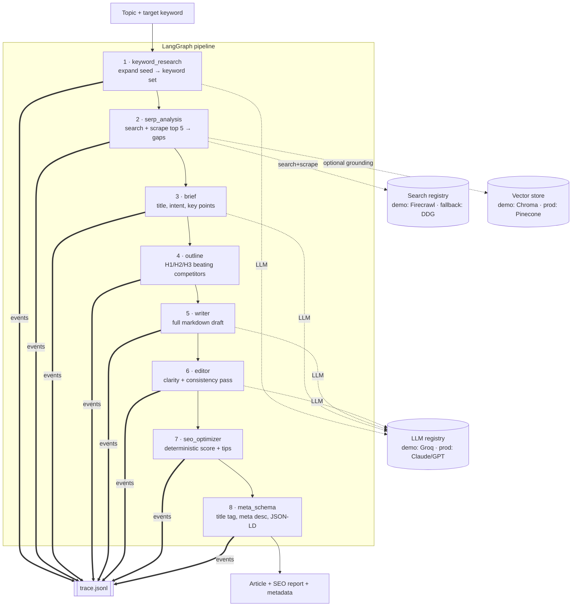

# Part 2 — Architecture

## System overview

This project is a **linear multi-agent DAG** orchestrated by LangGraph. A topic +
target keyword enter; a SERP-informed, on-page-optimized article with metadata
and JSON-LD schema exit. Every agent action is appended to `traces/trace.jsonl`.

## Components

| Component | File | Responsibility |
|---|---|---|
| Config | `app/config.py` | Typed env settings; demo/prod mode; 5-key Groq rotation |
| Tracer | `app/trace.py` | Append-only JSONL, per-run id, auto-timed `step()` context mgr |
| LLM registry | `app/llm/` | `base` interface + `groq` (demo, key-rotating) + `mock` (keyless) + `PROD_ROUTING` map |
| Search registry | `app/search/` | `base` interface + `firecrawl` (demo) + `ddg` (free fallback) |
| RAG store | `app/rag/store.py` | `VectorStore` interface + Chroma (demo) / Pinecone (prod, documented) |
| Agents | `app/agents/nodes.py` | The 8 node functions; each logs a trace event |
| Graph | `app/agents/graph.py` | LangGraph wiring + `run_pipeline()` |
| API | `app/main.py` | FastAPI: `/generate`, `/trace/{id}`, `/health`, UI |
| UI | `static/index.html` | Minimal demo front-end (form → result + live trace) |

## Design principles

1. **Vendor behind an interface.** No agent imports a vendor SDK. Demo→prod is a
   registry swap (`get_llm`, `get_search`), never a rewrite.
2. **Trace-first.** The `trace.jsonl` is the single source of truth for "what did
   each agent do." Humans read it; the `/trace/{id}` endpoint replays it.
3. **Degrade, never crash.** Missing keys → mock LLM / DDG search. An unsupported
   scrape URL is skipped, not fatal. The repo always runs.
4. **Deterministic where possible.** On-page SEO scoring (`_seo_checks`) and
   JSON-LD assembly are pure Python — reproducible and free of LLM variance.
5. **Config drift is a test failure.** `PROD_ROUTING` covers exactly the 8 agents
   (asserted in `tests/`), so docs and code stay in sync.

## Data flow (state)

`PipelineState` (`app/agents/state.py`) is a `TypedDict` accumulated across nodes:
`topic → keywords → serp/serp_insights → brief → outline → draft → edited →
seo → meta → article`. Each node returns only its slice; LangGraph merges.

## Prod enhancements (documented, not in the prototype)

- **Conditional loop**: `editor → seo_optimizer` until `score ≥ 80` (LangGraph
  conditional edge) — one-edge change.
- **Human-in-the-loop** approval gate after `brief` (LangGraph interrupt).
- **RAG grounding**: index scraped competitor pages in Pinecone; `writer`
  retrieves facts to cut hallucination.
- **Async fan-out**: scrape top-5 SERP pages concurrently (currently sequential).
- **n8n trigger** in front of `/generate` for non-technical operators.
- **Observability**: ship `trace.jsonl` events to Langfuse for eval/scoring.
